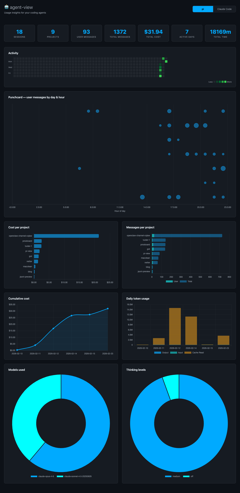
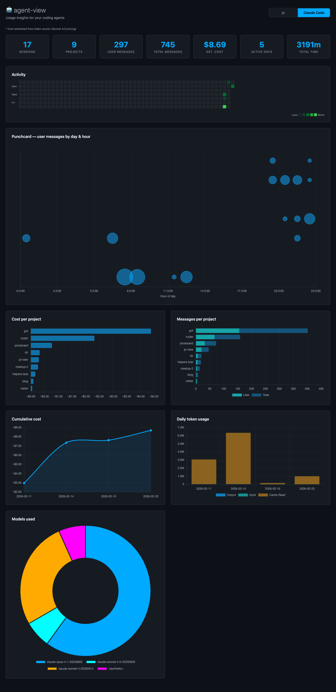

# agent-view

Usage insights for your coding agents.

## Screenshots




## Configuration

For optimal usage tracking, consider setting `cleanupPeriodDays` in your Claude Code settings.json. This controls how long usage data is retained.

See [Claude Code Settings](https://code.claude.com/docs/en/settings#available-settings) for more details.

## Getting Started

```bash
npm start
```